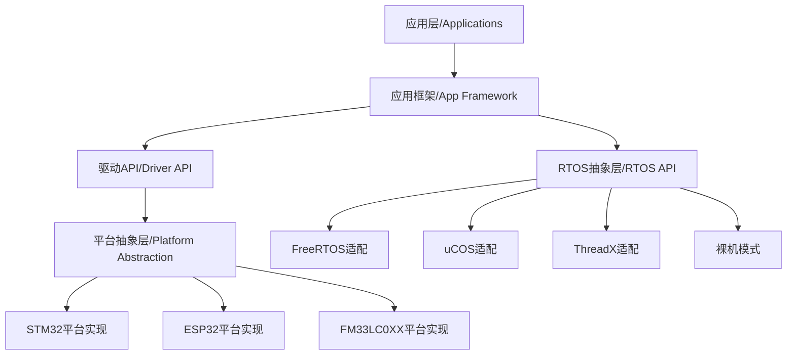
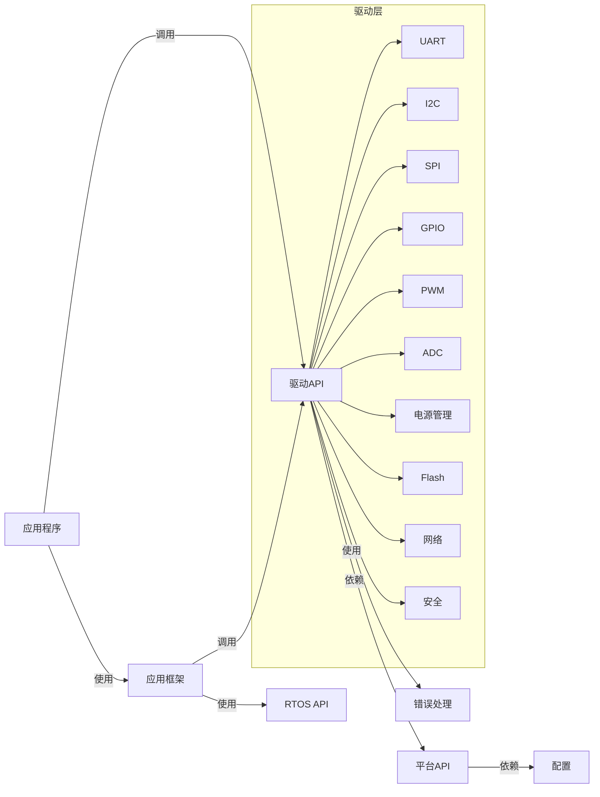
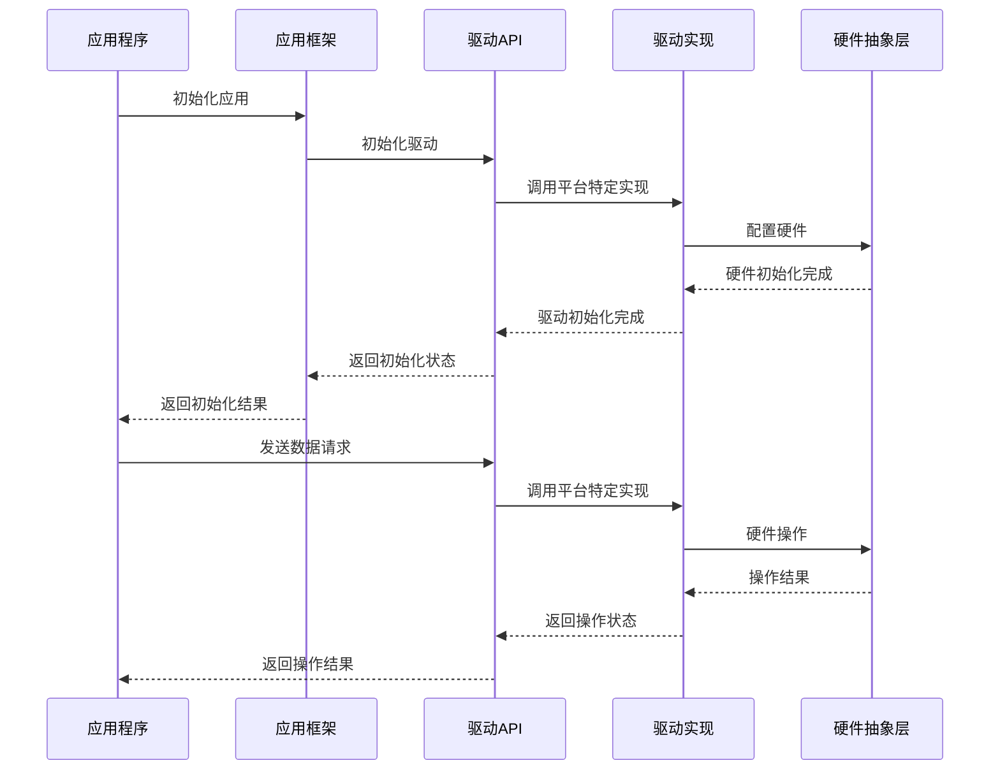
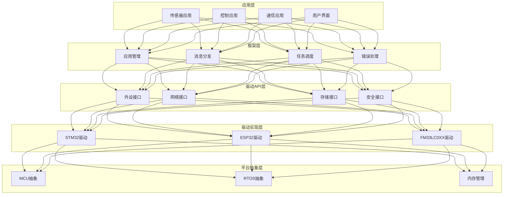
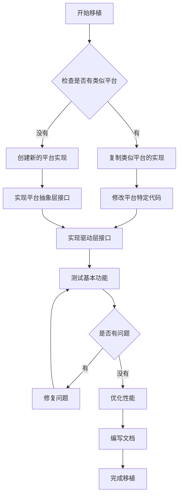
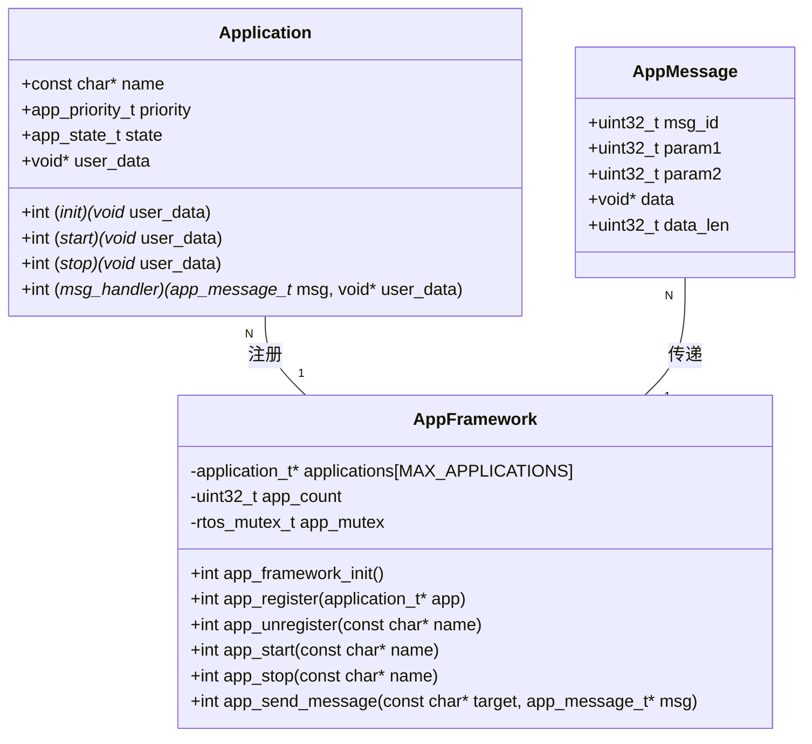
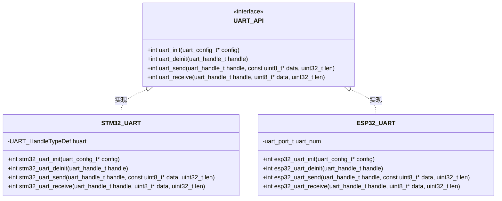

# 系统架构设计文档

## 1. 系统整体架构



## 2. 组件依赖关系



## 3. 数据流向图



## 4. 模块分层图



## 5. 移植流程图



## 6. 组件内部结构 - 应用框架



## 7. 驱动接口与实现关系



## 8. 分层架构设计

### 8.1 分层概述

我们对嵌入式软件框架进行了重构，采用了分层的软件架构设计，将接口按功能和抽象级别分为四个主要层次：

1. **基础层（Base Layer）**：低级硬件接口，如UART、GPIO、ADC等
2. **协议层（Protocol Layer）**：通信协议接口，如HTTP、MQTT、蓝牙等
3. **功能层（Feature Layer）**：高级功能接口，如摄像头、生物识别、访问控制等
4. **通用层（Common Layer）**：通用工具和定义，如驱动API、错误处理、日志等

这种分层设计使代码更加模块化，便于维护和扩展，同时也使得接口之间的依赖关系更加清晰。

### 8.2 层次结构详解

#### 8.2.1 基础层 (Base Layer)

基础层提供对底层硬件设备的抽象接口，包括：

- 通信接口：UART、SPI、I2C、CAN
- 数字IO：GPIO、PWM、中断
- 存储接口：Flash、SDIO、文件系统
- 系统接口：电源管理、时钟、看门狗
- 其他硬件：ADC、DMA、显示器、USB

**基础层的特点**：
- 直接与硬件交互
- 提供统一的驱动接口抽象
- 与特定平台相关但API统一

#### 8.2.2 协议层 (Protocol Layer)

协议层基于基础层构建，提供各种通信协议的接口，包括：

- 网络协议：HTTP、HTTPS、MQTT、WebSocket
- 安全协议：TLS、设备认证
- 设备通信：蓝牙、协议转换器
- 系统更新：OTA

**协议层的特点**：
- 依赖于基础层的硬件接口
- 封装通信协议细节
- 提供标准化的协议接口

#### 8.2.3 功能层 (Feature Layer)

功能层基于基础层和协议层构建，提供高级应用功能接口，包括：

- 多媒体：摄像头、音频、媒体管理
- 人机交互：触摸屏、显示
- 安全功能：访问控制、生物识别、加密
- 智能化：AI接口
- 设备管理：设备管理器、更新管理器

**功能层的特点**：
- 提供面向应用的高级功能
- 可能依赖多个基础层和协议层接口
- 封装复杂功能，简化应用开发

#### 8.2.4 通用层 (Common Layer)

通用层提供整个系统共用的工具和定义，包括：

- 系统工具：驱动API、错误处理、日志、JSON解析
- 配置管理：系统配置
- 操作系统抽象：RTOS接口
- 应用框架：事件总线、框架接口
- 测试工具：单元测试

**通用层的特点**：
- 被其他所有层使用
- 提供通用功能和定义
- 不依赖于其他层

### 8.3 依赖关系

层次之间的依赖关系如下：

- 应用层可以使用所有层的接口
- 功能层可以使用基础层、协议层和通用层的接口
- 协议层可以使用基础层和通用层的接口
- 基础层只能使用通用层的接口
- 通用层不依赖其他层

这种依赖关系确保了上层不会直接依赖于下层的实现细节，提高了代码的可维护性和可扩展性。

### 8.4 目录结构

新的目录结构如下：

```
include/
  ├── base/          # 基础层接口
  │   ├── uart_api.h
  │   ├── gpio_api.h
  │   └── ...
  ├── protocol/      # 协议层接口
  │   ├── http_client_api.h
  │   ├── mqtt_client_api.h
  │   └── ...
  ├── feature/       # 功能层接口
  │   ├── camera_api.h
  │   ├── biometric_api.h
  │   └── ...
  └── common/        # 通用层接口
      ├── driver_api.h
      ├── error_api.h
      └── ...

drivers/
  ├── base/          # 基础层驱动实现
  │   ├── uart/
  │   ├── gpio/
  │   └── ...
  ├── protocol/      # 协议层驱动实现
  │   ├── network/
  │   ├── http/
  │   └── ...
  └── feature/       # 功能层驱动实现
      ├── camera/
      ├── security/
      └── ...
```

### 8.5 编码规范

为了保持代码的一致性，请遵循以下规范：

1. 包含路径使用层次前缀，例如：
   ```c
   #include "base/uart_api.h"
   #include "common/error_api.h"
   ```

2. 接口命名遵循 `<功能>_api.h` 格式

3. 接口内部函数命名遵循 `<功能>_<操作>` 格式，例如：
   ```c
   uart_init()
   camera_capture_frame()
   ```

4. 结构体和枚举命名使用 `<功能>_<类型>_t` 格式，例如：
   ```c
   typedef struct {
       // ...
   } uart_config_t;
   ```
